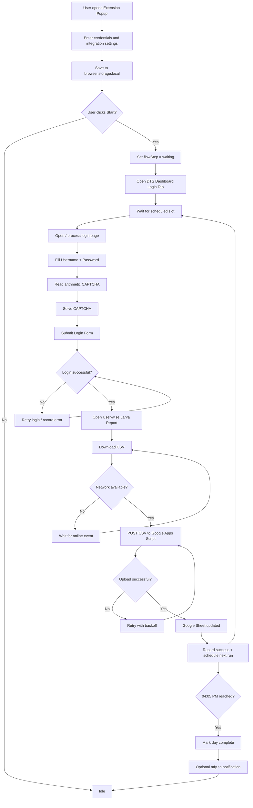
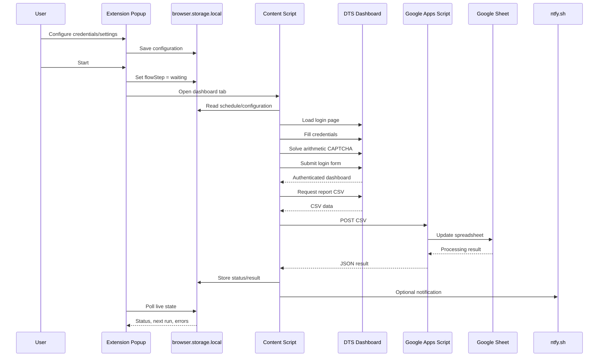
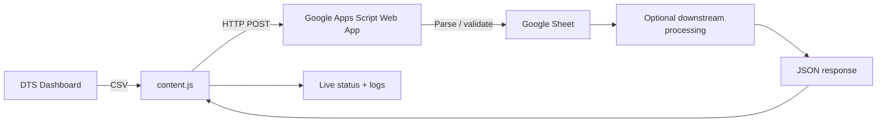

# DTS Dashboard Auto-Login

> **Browser automation extension for the Punjab DTS Dashboard**
>
> Automates scheduled dashboard login, simple arithmetic CAPTCHA solving, report retrieval, CSV synchronization to Google Sheets, network-aware retries, live run status, and optional phone notifications.

[](https://developer.mozilla.org/en-US/docs/Mozilla/Add-ons/WebExtensions/manifest.json)
[](https://github.com/sheerazautomate/dtsextension)
[](LICENSE)

---

## 📌 Overview

**DTS Dashboard Auto-Login** is a lightweight browser extension designed to remove repetitive manual work from the DTS Dashboard reporting workflow.

Once configured, the extension can:

- Open the DTS Dashboard automatically at scheduled times.
- Fill the saved username and password.
- Detect and solve the dashboard's simple arithmetic CAPTCHA.
- Submit the login form automatically.
- Navigate through the reporting workflow.
- Download the current user-wise larva report as CSV.
- Send the CSV to a configured Google Apps Script Web App.
- Allow the Apps Script endpoint to update a Google Sheet and trigger downstream processing.
- Detect network outages and wait for connectivity to return.
- Retry failed network requests with incremental backoff.
- Show a live status overlay directly on the dashboard tab.
- Display network, flow, next-run, success, and error information in the extension popup.
- Optionally send high-priority notifications to a phone through `ntfy.sh` when a run becomes stuck or the daily schedule finishes.

The extension is intentionally small: the core automation lives in `content.js`, while the popup provides configuration and control.

---

## ✨ Key Features

| Feature | Description |
|---|---|
| 🔐 Automatic login | Fills configured credentials and submits the login form. |
| 🧮 CAPTCHA solver | Parses simple arithmetic expressions such as `7 + 3` or `12 × 2`. |
| ⏰ Fixed schedule | Runs every 30 minutes from **08:05 AM through 04:05 PM**. |
| 🌐 Network awareness | Pauses while offline and resumes when connectivity returns. |
| 🔁 Automatic retry | Retries failed requests using progressive backoff. |
| 📊 CSV reporting | Retrieves the configured user-wise larva report as CSV. |
| ☁️ Google Sheets sync | Sends CSV data to a Google Apps Script Web App. |
| 📱 Phone alerts | Optional `ntfy.sh` notifications for prolonged failures and completion. |
| 🖥️ Live overlay | Displays countdown, current operation, network state, and recent logs. |
| 📋 Popup dashboard | Shows live flow state, next run, last success, and last error. |
| ⏹️ Manual stop | Stops the automation without removing saved configuration. |

---

## 🏗️ Architecture

The project uses a simple event-driven WebExtension architecture. The popup controls the automation state, while the content script performs the actual dashboard interaction.



### Data flow



---

## 🔄 Automation Workflow

Each scheduled run follows this general sequence:

1. **Wait for the next scheduled slot.**
2. **Open the DTS Dashboard.**
3. **Detect the login form.**
4. **Fill username and password.**
5. **Read the arithmetic CAPTCHA prompt.**
6. **Calculate the answer locally.**
7. **Submit the login form.**
8. **Access the user-wise larva report.**
9. **Download the CSV response.**
10. **Send the CSV to the configured Google Apps Script Web App.**
11. **Record the result in extension storage.**
12. **Wait for the next scheduled slot.**
13. **Stop automatically after the final 04:05 PM run.**

If the internet connection disappears during a network operation, the workflow does **not** simply fail. It waits for the browser's `online` event and then resumes the operation.

---

## ⏱️ Default Schedule

The current schedule is hard-coded in `content.js`:

| Run | Time | Run | Time |
|---:|---|---:|---|
| 1 | 08:05 | 10 | 12:35 |
| 2 | 08:35 | 11 | 13:05 |
| 3 | 09:05 | 12 | 13:35 |
| 4 | 09:35 | 13 | 14:05 |
| 5 | 10:05 | 14 | 14:35 |
| 6 | 10:35 | 15 | 15:05 |
| 7 | 11:05 | 16 | 15:35 |
| 8 | 11:35 | 17 | 16:05 |
| 9 | 12:05 | | |

**Total:** 17 scheduled runs per day.

To change the schedule, edit the `SCHEDULE_TIMES` array in `content.js`.

---

## 📁 Project Structure

```text
dtsextension/
├── manifest.json       # Extension manifest and permissions
├── background.js       # Installation/background lifecycle stub
├── content.js          # Main automation engine
├── popup.html          # Configuration and status UI
├── popup.js            # Popup logic and state management
└── README.md           # Project documentation
```

### Component responsibilities

#### `manifest.json`

Defines the WebExtension configuration, permissions, host access, popup, background script, and content-script injection rules.

The extension currently declares access to:

- `https://dashboard-tracking.punjab.gov.pk/*`
- `https://script.google.com/*`

It also uses the `storage` permission. fileciteturn0file0L1-L2

#### `content.js`

The main automation engine. It handles:

- Scheduling.
- Dashboard navigation.
- Login form detection.
- Credential injection.
- Arithmetic CAPTCHA parsing and solving.
- Report/CSV retrieval.
- Google Apps Script synchronization.
- Network monitoring.
- Retry/backoff logic.
- Countdown and status overlay.
- State persistence.
- Optional phone notifications.

The script defines the reporting schedule from 08:05 through 16:05 at 30-minute intervals. fileciteturn2file0L2-L2

#### `popup.html` / `popup.js`

The popup is the operator control panel. It provides fields for:

- Username
- Password
- Apps Script Web App URL
- Shared Secret
- `ntfy.sh` topic

It also exposes **Save Credentials**, **Start**, and **Stop** controls and a live status section. fileciteturn1file0L2-L2

`popup.js` stores configuration and flow state using `browser.storage.local` and refreshes the live status approximately every two seconds. fileciteturn5file0L2-L2

#### `background.js`

Currently a minimal lifecycle stub. The automation itself is handled by the content script. The file is intentionally retained as an extension point for future alarms, notifications, or other background functionality. fileciteturn3file0L2-L2

---

## 🧩 Configuration

Open the extension popup and configure the following values.

### 1. Username

The username used by the DTS Dashboard login form.

### 2. Password

The corresponding dashboard password.

### 3. Apps Script Web App URL

The deployed Google Apps Script endpoint that receives the CSV.

Example format:

```text
https://script.google.com/macros/s/YOUR_DEPLOYMENT_ID/exec
```

### 4. Shared Secret

An optional shared value used to authenticate the CSV upload request against the Apps Script endpoint.

The extension appends the configured value as the `secret` query parameter when a secret is configured.

### 5. ntfy.sh Topic

Optional. Configure a topic if you want phone notifications.

Example:

```text
sheeraz-dengue-sync-x7f2
```

The extension uses the topic for best-effort notifications when a process remains stuck for an extended period and when the daily reporting schedule finishes.

---

## 🔐 Security Considerations

This extension handles login credentials, so security should be treated as a first-class concern.

### Credential storage

Credentials and integration settings are stored using the browser's local extension storage. The current implementation does **not** provide application-level encryption for these values. fileciteturn5file0L2-L2

Therefore:

- Install the extension only in a trusted browser profile.
- Do not share the browser profile with untrusted users.
- Do not commit credentials, Apps Script URLs containing secrets, or private configuration to Git.
- Use a strong, unique shared secret for the Apps Script endpoint.
- Treat the `ntfy.sh` topic as a private notification channel identifier.
- Review the extension permissions before installation.

### CAPTCHA scope

The built-in CAPTCHA logic is designed specifically for simple arithmetic expressions. It is not a general-purpose CAPTCHA bypass system. The solver recognizes numeric expressions using operators such as `+`, `-`, `*`, `x`, `×`, and `/`. fileciteturn2file0L2-L2

---

## 🌐 Network Resilience

The automation is designed for environments where the internet connection may temporarily disappear.

When a request fails:

```text
Request
  │
  ├── Online ──────────────► Continue
  │
  └── Offline / Failed
          │
          ▼
     Wait / Retry
          │
          ├── Connection restored ──► Continue
          │
          └── Still unavailable ────► Backoff and retry
```

The current implementation uses retry delays that increase progressively up to a configured maximum. If a network operation remains stuck for more than five minutes, the extension can send an optional high-priority `ntfy.sh` notification. fileciteturn2file0L2-L2

---

## 📊 Google Sheets Integration

The browser extension does not directly manipulate Google Sheets.

Instead, the integration is intentionally split into two parts:



This separation keeps the browser automation independent from spreadsheet implementation details.

The extension expects the Apps Script endpoint to return JSON containing an `ok` indicator. A successful response can also report the number of rows written and optional macro/log information. fileciteturn2file0L2-L2

### Recommended Apps Script contract

Your Web App should accept:

```http
POST /exec?secret=YOUR_SHARED_SECRET
Content-Type: text/plain

<CSV CONTENT>
```

A successful response should resemble:

```json
{
  "ok": true,
  "rows": 123
}
```

Additional fields may be returned for logging or downstream processing.

---

## 🚀 Installation

### Option A — Load as an unpacked extension

1. Clone or download this repository.
2. Open your browser's extension management page.
3. Enable **Developer Mode**.
4. Choose **Load Temporary Add-on** / **Load Unpacked**, depending on the browser.
5. Select the extension's `manifest.json` file or project directory.
6. Pin the extension to the browser toolbar for convenient access.

> **Browser compatibility note:** The code uses the WebExtensions `browser.*` API and currently declares a Manifest V3 configuration. The project should therefore be tested in the target browser rather than assuming identical behavior across Chromium and Firefox implementations.

### Option B — Clone with Git

```bash
git clone https://github.com/sheerazautomate/dtsextension.git
cd dtsextension
```

Then load the project as an unpacked extension.

---

## ▶️ Usage

### First-time setup

1. Install/load the extension.
2. Open the extension popup.
3. Enter your DTS Dashboard username.
4. Enter your password.
5. Enter the deployed Google Apps Script Web App URL.
6. Enter the shared secret if your Apps Script endpoint requires one.
7. Optionally enter an `ntfy.sh` topic.
8. Click **Save Credentials**.

### Start automation

Click **Start**.

The extension will:

- Save the configuration.
- Set the automation state to `waiting`.
- Open a new DTS Dashboard tab.
- Wait for the next scheduled time.
- Execute the login/report/synchronization workflow.

The popup and dashboard overlay provide live feedback while the workflow is running. fileciteturn1file0L2-L2

### Stop automation

Click **Stop** in the popup.

The extension changes the flow state to `idle` and clears the next scheduled run. The current dashboard overlay also reflects the stopped state. fileciteturn5file0L2-L2

---

## 🖥️ Live Monitoring

The dashboard tab displays a persistent overlay containing:

- Countdown to the next scheduled event.
- Current automation step.
- Network state.
- Recent execution log.
- Retry/wait information.

The popup separately reports:

- **Network** — Online/Offline.
- **Flow step** — Current automation state.
- **Next run** — Next scheduled execution.
- **Last success** — Most recent successful run.
- **Last error** — Most recent recorded error.

This makes the extension suitable for unattended operation while still giving the operator visibility into what is happening.

---

## 🧠 State Management

The extension uses `browser.storage.local` as its lightweight state store.

Typical state includes:

```text
username
password
scriptUrl
secret
ntfyTopic
flowStep
loginAttempts
nextRunAt
lastSuccessAt
lastError
isOnline
dayComplete
```

This allows the automation state to survive page navigation and keeps the popup synchronized with the dashboard tab.

---

## 🛠️ Development

No build system is currently required. The repository consists of plain JavaScript, HTML, and a WebExtension manifest.

### Local development workflow

```bash
git clone https://github.com/sheerazautomate/dtsextension.git
cd dtsextension
```

Then:

1. Edit the source files.
2. Reload the extension from the browser's extension manager.
3. Open the DTS Dashboard.
4. Test the relevant workflow.
5. Inspect the browser console and extension popup status.
6. Verify the Google Apps Script response and spreadsheet update.

### Suggested debugging order

```text
Popup configuration
        ↓
Storage state
        ↓
Scheduled state
        ↓
Dashboard tab
        ↓
Login form detection
        ↓
CAPTCHA parsing
        ↓
Login submission
        ↓
Report retrieval
        ↓
CSV generation
        ↓
Apps Script POST
        ↓
Google Sheet update
```

---

## 🧪 Testing Checklist

Before relying on the automation for production reporting, verify each layer independently:

- [ ] Extension loads without manifest errors.
- [ ] Popup opens correctly.
- [ ] Credentials save and reload correctly.
- [ ] Start opens the dashboard tab.
- [ ] Next scheduled time is calculated correctly.
- [ ] Login form is detected.
- [ ] Username is filled correctly.
- [ ] Password is filled correctly.
- [ ] Arithmetic CAPTCHA is solved correctly.
- [ ] Login submission succeeds.
- [ ] Report URL is accessible after login.
- [ ] CSV is downloaded successfully.
- [ ] Apps Script accepts the POST request.
- [ ] Shared-secret validation works.
- [ ] Google Sheet receives the expected rows.
- [ ] Failed requests retry correctly.
- [ ] Offline mode pauses instead of abandoning the run.
- [ ] Reconnection resumes the workflow.
- [ ] Popup status updates correctly.
- [ ] `ntfy.sh` notification works if enabled.
- [ ] Stop correctly returns the automation to idle.
- [ ] Final 04:05 PM run marks the day complete.

---

## ⚠️ Limitations

1. **Dashboard dependency** — Changes to the DTS login page, form IDs, CAPTCHA format, report URL, or authentication flow may require changes to `content.js`.
2. **CAPTCHA scope** — The solver only handles simple arithmetic CAPTCHA text; it is not intended for image, audio, or sophisticated anti-bot challenges.
3. **Schedule is currently fixed** — The daily run times are defined in source code rather than configurable from the popup.
4. **Browser storage is not encrypted by the application** — Protect the browser profile appropriately.
5. **Google Apps Script is an external dependency** — Spreadsheet synchronization requires a working deployed endpoint.
6. **`ntfy.sh` is optional** — Phone notifications are best-effort and should not be treated as the primary monitoring mechanism.
7. **Background script is currently minimal** — Most automation work is performed by the content script.

---

## 🔮 Future Improvements

Potential improvements include:

- [ ] Configurable schedules from the popup.
- [ ] Per-run enable/disable controls.
- [ ] Better authentication failure detection.
- [ ] More robust dashboard DOM selectors.
- [ ] Automatic session-expiry detection.
- [ ] Persistent execution history.
- [ ] Exportable diagnostic logs.
- [ ] Encrypted credential storage or integration with browser credential facilities.
- [ ] Configurable retry policy.
- [ ] Browser-native notifications.
- [ ] Background alarms for more reliable scheduling.
- [ ] Automated health checks for the Apps Script endpoint.
- [ ] Versioned Google Sheet schema validation.
- [ ] CI-based linting and automated extension smoke tests.

---

## 🤝 Contributing

Contributions, bug reports, and improvements are welcome.

A good contribution should:

1. Explain the problem being solved.
2. Keep changes focused and maintainable.
3. Avoid hard-coding credentials or private deployment details.
4. Preserve existing reporting behavior unless the change intentionally modifies it.
5. Include testing notes for changes affecting the automation flow.

### Pull request checklist

- [ ] Code tested locally.
- [ ] No credentials or secrets committed.
- [ ] Manifest remains valid.
- [ ] Dashboard selectors tested.
- [ ] Network retry behavior tested where applicable.
- [ ] README updated if behavior/configuration changed.

---

## 🐛 Troubleshooting

### Extension does not start

Check:

- The extension is enabled.
- Developer mode is enabled if running unpacked.
- `manifest.json` loads without errors.
- The extension popup can access local storage.

### Login fields are not filled

The automation expects the dashboard login form to expose the relevant elements, including the known username, password, and CAPTCHA fields. If the website changes its HTML structure, the selectors in `content.js` may need updating.

### CAPTCHA is reported as unreadable

The current solver expects a simple numeric expression. Verify that the CAPTCHA text is available in the page DOM and follows a supported arithmetic format.

### CSV upload fails

Check:

1. The Apps Script URL is correct and deployed as a Web App.
2. The deployment is accessible to the browser's request context.
3. The shared secret matches.
4. The Apps Script endpoint accepts `POST` requests.
5. The endpoint returns valid JSON.
6. Browser console/network logs show the expected request.

### Automation gets stuck offline

The extension intentionally waits for connectivity rather than abandoning the workflow. Restore the internet connection and allow the browser to emit its `online` event.

### Notifications do not arrive

Check that:

- An `ntfy.sh` topic is configured.
- The phone is subscribed to the exact same topic.
- The browser can reach `ntfy.sh`.
- Notification permissions are enabled on the phone.

---

## 📜 License

See the repository's `LICENSE` file for licensing terms.

If no license has been added yet, the repository should be considered **all rights reserved by default** rather than automatically assumed to be open source.

---

## 👤 Author

**Sheeraz Saleem**

GitHub: [@sheerazautomate](https://github.com/sheerazautomate)

Project: [dtsextension](https://github.com/sheerazautomate/dtsextension)

---

## ⭐ Project Philosophy

The goal of this project is straightforward:

> **Automate repetitive reporting work, keep the operator informed, and make temporary network failures recoverable instead of turning them into manual work.**

The extension is deliberately lightweight and dependency-free so that the automation remains easy to inspect, modify, and deploy.
