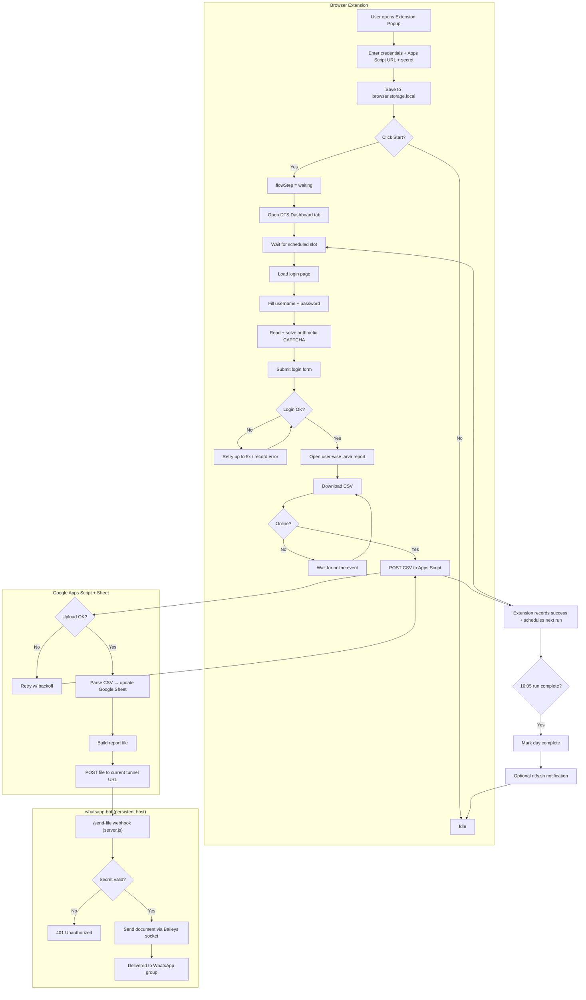
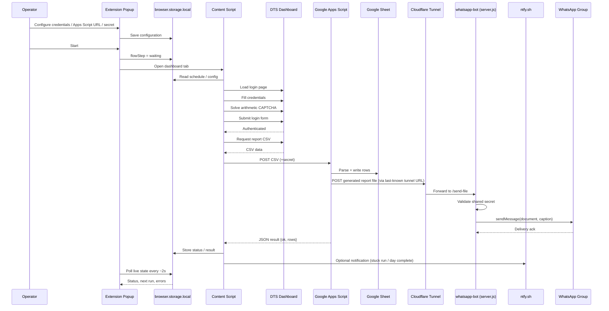
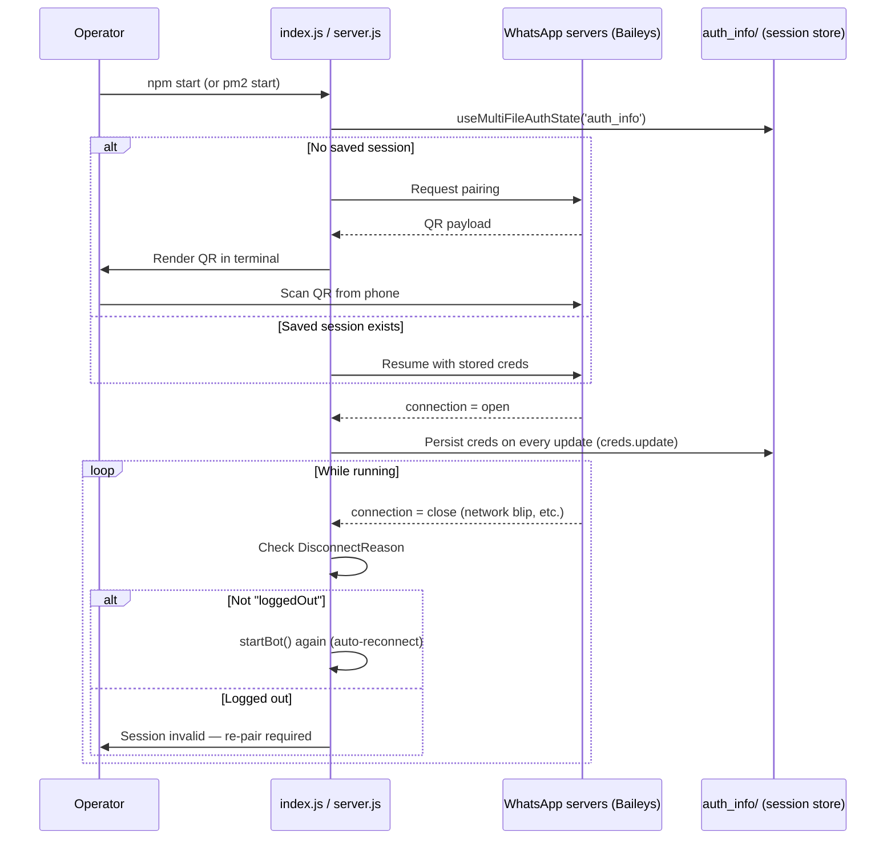

# DTS Dashboard Auto-Login + WhatsApp Report Bot

> **Browser automation + WhatsApp delivery pipeline for the Punjab DTS Dashboard**
>
> A Manifest V3 browser extension automates scheduled dashboard login, CAPTCHA solving,
> CSV report retrieval, and Google Sheets sync. A companion Node.js WhatsApp bot (Baileys)
> receives generated report files from Google Apps Script and delivers them straight to a
> WhatsApp group — turning a manual, repetitive reporting chore into an unattended pipeline
> with live status, retries, and phone alerts.

---

## 📌 Overview

This repository contains **two interlinked projects**:

| Project | What it is | Where it runs |
|---|---|---|
| **`/` (extension root)** | A Manifest V3 WebExtension that logs into the DTS Dashboard, solves the arithmetic CAPTCHA, downloads the CSV report, and pushes it to a Google Apps Script Web App | Inside the operator's browser |
| **`whatsapp-bot/`** | A Node.js service (Baileys WhatsApp Web socket + Express webhook) that receives files from Apps Script and forwards them into a WhatsApp group | A persistent host/server (e.g. a VPS or always-on machine), tunneled to the internet via Cloudflare |

They are connected **indirectly**, through Google Apps Script acting as the middle layer:

```
Browser Extension  →  Google Apps Script / Sheet  →  Cloudflare Tunnel  →  whatsapp-bot  →  WhatsApp Group
```

The extension never talks to the WhatsApp bot directly. Apps Script is the integration point —
it receives the CSV, updates the spreadsheet, generates/collects a report file, and POSTs that
file to whichever Cloudflare tunnel URL the bot last reported.

---

## ✨ Key Features

### Browser extension (DTS Dashboard Auto-Login)

| Feature | Description |
|---|---|
| 🔐 Automatic login | Fills configured credentials and submits the login form |
| 🧮 CAPTCHA solver | Parses simple arithmetic expressions (`+ - * x × /`) |
| ⏰ Fixed schedule | Runs every 30 minutes, **08:05 → 16:05** (17 runs/day) |
| 🌐 Network awareness | Pauses while offline, resumes on the `online` event |
| 🔁 Automatic retry | Login retries (max 5) and network retries with progressive backoff (up to 30s) |
| 📊 CSV reporting | Downloads the user-wise larva report as CSV |
| ☁️ Google Sheets sync | POSTs CSV to a configured Apps Script Web App |
| 📱 Phone alerts | Optional `ntfy.sh` push notification on stuck runs / day completion |
| 🖥️ Live overlay | Injects a countdown/status/log overlay onto the dashboard tab |
| 📋 Popup dashboard | Shows network, flow step, next run, last success, last error |

### WhatsApp bot (`whatsapp-bot/`)

| Feature | Description |
|---|---|
| 📲 WhatsApp Web session | Uses **Baileys** (`@whiskeysockets/baileys`) multi-file auth state, no official WhatsApp Business API needed |
| 🔑 QR pairing | `qrcode-terminal` prints a scannable QR code on first run |
| 🔄 Auto-reconnect | Reconnects automatically unless the session was explicitly logged out |
| 🌐 Webhook server | `server.js` exposes `POST /send-file` (Express) so Apps Script can push documents on demand |
| 📄 File delivery | Accepts a base64 payload + filename/caption and sends it as a document to a fixed WhatsApp group JID |
| 🩺 Health check | `GET /health` reports connection status |
| 🌍 Cloudflare Quick Tunnel | `tunnel.sh` exposes the local server publicly and reports the current tunnel URL back to Apps Script, since Quick Tunnel URLs rotate on every restart |
| 🧰 Group discovery utility | `get-groups.js` lists all WhatsApp group names + JIDs the bot account belongs to, for finding the target group ID |

---

## 🏗️ Architecture

### End-to-end flow



### Data flow (sequence)



### WhatsApp bot connection lifecycle



---

## 📁 Project Structure

```
dtsextension/
├── manifest.json          # WebExtension manifest (MV3), permissions, host access
├── background.js          # Minimal background lifecycle stub
├── content.js             # Main automation engine (schedule, login, CAPTCHA, CSV, sync)
├── popup.html             # Operator configuration + status UI
├── popup.js                # Popup logic, storage read/write, live polling (~2s)
├── icons/                 # Extension icons (16/32/48/96/128 px)
├── dtsextension.zip        # Pre-zipped build of the extension (for distribution/upload)
├── README.md
│
└── whatsapp-bot/           # Companion Node.js WhatsApp delivery service
    ├── index.js            # Minimal Baileys bootstrap (connect + QR + reconnect only)
    ├── server.js           # Production entry point: Baileys client + Express webhook (/send-file, /health)
    ├── get-groups.js        # One-off CLI utility: lists all group names + JIDs for the logged-in account
    ├── tunnel.sh            # Starts a Cloudflare Quick Tunnel, watches for the URL, reports it to Apps Script
    ├── package.json / package-lock.json
    ├── node_modules/        # Installed dependencies (Baileys, Express, qrcode-terminal)
    ├── auth_info/           # ⚠️ Baileys multi-file session/credential store (see Security below)
    ├── cloudflare              # ⚠️ Stray file: last-reported tunnel URL, appears committed by accident
    └── "get groups"            # ⚠️ Stray file: captured output of get-groups.js (real group names + JIDs), appears committed by accident
```

### Component responsibilities

#### `manifest.json`
Declares MV3 config, `storage` permission, and host access limited to:
- `https://dashboard-tracking.punjab.gov.pk/*`
- `https://script.google.com/*`

The content script is injected only on the dashboard host, at `document_idle`.

#### `content.js`
The extension's automation engine. Responsibilities: schedule computation (`SCHEDULE_TIMES`, 08:05–16:05 every 30 min), login-page DOM interaction, CAPTCHA text parsing + arithmetic evaluation, CSV download, `fetch()` POST to the Apps Script URL with retry/backoff, network `online`/`offline` handling, on-page overlay rendering, state persistence via `browser.storage.local`, and optional `ntfy.sh` POST for stuck-run/day-complete alerts.

#### `popup.html` / `popup.js`
Operator control panel: fields for username, password, Apps Script Web App URL, shared secret, and `ntfy.sh` topic; **Save Credentials**, **Start**, **Stop** actions; live status section polling storage roughly every 2 seconds.

#### `background.js`
Minimal MV3 background script — largely a lifecycle stub, reserved for future alarms/notifications. Almost all logic currently lives in `content.js`.

#### `whatsapp-bot/index.js`
The smallest possible Baileys client: connects, prints a QR when needed, persists credentials on `creds.update`, and reconnects automatically unless the session was explicitly logged out. Useful for first-time pairing or quick debugging — **not** the file you'd run in production, since it exposes no HTTP interface.

#### `whatsapp-bot/server.js`
The actual production entry point. Combines the same Baileys client as `index.js` with an Express server that exposes:
- `POST /send-file` — accepts `{ secret, filename, base64, caption }`, validates the shared secret, decodes the base64 payload, and sends it as a document to a **hard-coded** WhatsApp group JID (`TEST_GROUP_JID`).
- `GET /health` — returns `{ status, connected }`.

#### `whatsapp-bot/get-groups.js`
A throwaway CLI script: connects with the existing saved session, calls `groupFetchAllParticipating()`, prints every group's name and JID, then exits. Used to find the correct JID to hard-code into `server.js`.

#### `whatsapp-bot/tunnel.sh`
Starts `cloudflared tunnel --url http://localhost:3000` as a Quick Tunnel (no Cloudflare account/domain needed), tails its log for the freshly-assigned `*.trycloudflare.com` URL, and — every time that URL changes — POSTs it to the Apps Script Web App so Apps Script always knows where to deliver files. Meant to be run under a process manager (e.g. `pm2`) rather than directly, since Quick Tunnel URLs are ephemeral and rotate on every restart.

---

## 🔗 How the two projects actually connect

The extension and the bot **do not** call each other directly — there is no direct network
path between the browser and `whatsapp-bot`. The link is entirely mediated by the Apps Script
Web App and the Cloudflare tunnel:

```mermaid
flowchart LR
    A[DTS Dashboard] -->|CSV| B[content.js]
    B -->|HTTP POST + secret| C[Google Apps Script Web App]
    C -->|Parse / validate| D[Google Sheet]
    D --> E[Report file generated]
    E -->|HTTP POST base64 file + secret| F[Cloudflare Tunnel URL]
    F --> G["whatsapp-bot /send-file"]
    G --> H[Baileys socket]
    H --> I[WhatsApp Group]
    C -->|JSON result| B
```



This design keeps the browser automation fully decoupled from WhatsApp delivery details —
the extension only ever needs to know the Apps Script URL, never the bot's address, since
the bot's public URL changes on every restart and is self-reported via `tunnel.sh`.

### Recommended Apps Script → bot contract

```
POST <current tunnel URL>/send-file
Content-Type: application/json

{
  "secret": "YOUR_SHARED_SECRET",
  "filename": "report.pdf",
  "base64": "<base64-encoded file>",
  "caption": "optional caption text"
}
```

Response:
```json
{ "status": "sent", "filename": "report.pdf" }
```

---

## 🧩 Configuration

### Extension popup
1. **Username** — DTS Dashboard login username
2. **Password** — DTS Dashboard login password
3. **Apps Script Web App URL** — e.g. `https://script.google.com/macros/s/YOUR_DEPLOYMENT_ID/exec`
4. **Shared Secret** — appended as the `secret` query parameter on CSV uploads
5. **ntfy.sh Topic** (optional) — e.g. `sheeraz-dengue-sync-x7f2`, for phone alerts

### `whatsapp-bot/server.js` (edit in source — not exposed via any UI)
```js
const PORT = 3000;
const TEST_GROUP_JID = '120363412435970342@g.us'; // target WhatsApp group
const SHARED_SECRET = 'blahblah';                  // must match Apps Script's value
```

### `whatsapp-bot/tunnel.sh`
```bash
APPS_SCRIPT_WEBAPP_URL="https://script.google.com/macros/s/.../exec"
URL_UPDATE_SECRET="blahblah"   # must match Apps Script's URL_UPDATE_SECRET
LOCAL_PORT=3000
```

> All three secrets above (extension's shared secret, `server.js`'s `SHARED_SECRET`, and
> `tunnel.sh`'s `URL_UPDATE_SECRET`) must be coordinated with whatever the Apps Script
> deployment expects — they are not automatically synced anywhere.

---

## 🚀 Installation

### Browser extension
1. Clone the repo (`git clone https://github.com/sheerazautomate/dtsextension.git`).
2. Open the browser's extension management page and enable **Developer Mode**.
3. **Load Unpacked** → select the repo root (or `manifest.json`).
4. Pin the extension to the toolbar.

> The manifest declares `browser_specific_settings.gecko`, meaning it targets Firefox
> (MV3), but uses the `browser.*` namespace generally. Test in your actual target
> browser rather than assuming identical behavior across Chromium/Firefox.

### WhatsApp bot
```bash
cd whatsapp-bot
npm install
node server.js        # production entry point (Baileys + webhook)
# or, for first-time pairing / debugging only:
node index.js
```
On first run (no `auth_info/` session yet), a QR code prints in the terminal — scan it
from WhatsApp → **Linked Devices** → **Link a Device**.

To expose the webhook publicly and keep Apps Script aware of the URL:
```bash
chmod +x tunnel.sh
pm2 start tunnel.sh --name dts-tunnel
pm2 start server.js --name dts-whatsapp-bot
```

To find a group's JID (for updating `TEST_GROUP_JID`):
```bash
node get-groups.js
```

---

## 🔐 Security Considerations — **read before deploying**

This is the most important section. The current repository state has several issues that
should be treated as **must-fix before any real-world / production use**, not just
"nice to have":

### 🔴 Critical — WhatsApp session credentials are committed to Git
`whatsapp-bot/auth_info/` (≈3,900 files, ~16MB) contains the **live Baileys multi-file
auth state** — the actual signed-in WhatsApp session keys. Anyone with read access to
this repository can use these files to impersonate the linked WhatsApp account without
ever scanning a QR code. This should never have been committed.

**Action items:**
- Immediately log out / unlink the device from WhatsApp (**Linked Devices** on the phone)
  to invalidate the exposed session.
- Add `auth_info/` to `.gitignore` (there currently is none in the repo).
- Rewrite Git history to purge `auth_info/` from all commits (`git filter-repo` or BFG),
  since deleting the folder in a new commit does not remove it from history.
- Re-pair the bot with a fresh session after history is cleaned.

### 🔴 Critical — hard-coded, weak shared secrets
`SHARED_SECRET = 'blahblah'` in `server.js` and `URL_UPDATE_SECRET="blahblah"` in
`tunnel.sh` are both placeholder-strength values committed directly in source. Anyone
who finds the tunnel URL (see below) and this secret can push arbitrary files to the
WhatsApp group.

**Action items:** move secrets to environment variables / a `.env` file (excluded from
Git), and use long, random values.

### 🟠 High — live tunnel URL and real group data committed
The `whatsapp-bot/cloudflare` file contains a live `*.trycloudflare.com` URL, and the
`whatsapp-bot/get groups` file contains real WhatsApp group names and JIDs (one of which
embeds a phone number). These look like accidental commits of runtime/debug output
rather than intentional source files.

**Action items:** delete both from the repo and history, and add patterns like
`cloudflare`, `get groups`, `*.log` to `.gitignore`.

### 🟠 High — extension credential storage is not encrypted
Per the original extension README, `username`/`password` are stored in
`browser.storage.local` without application-level encryption. Treat the browser
profile itself as sensitive, and don't share it.

### 🟡 Medium — hard-coded target group
`TEST_GROUP_JID` is hard-coded in `server.js`. There's no way to change the delivery
target without editing and restarting the bot — worth making configurable (env var or
small config file) once secrets are cleaned up.

### 🟡 Medium — no `.gitignore` at all
The complete absence of a `.gitignore` is what allowed `node_modules/`,
`auth_info/`, and stray debug files into version control in the first place. This is the
root cause of most issues above.

**Minimum recommended `.gitignore` for `whatsapp-bot/`:**
```
node_modules/
auth_info/
*.log
cloudflare
get groups
.env
```

---

## 🌐 Network Resilience

Both halves of the system are built to tolerate transient failures rather than fail hard:

**Extension:**
```
Request
  │
  ├── Online ──────────────► Continue
  │
  └── Offline / Failed
          │
          ▼
     Wait / Retry
          │
          ├── Connection restored ──► Continue
          └── Still unavailable ────► Backoff and retry (up to 30s)
```
If a network operation is stuck for more than 5 minutes, an optional `ntfy.sh`
notification can be sent.

**WhatsApp bot:** Baileys' `connection.update` handler checks `DisconnectReason` on every
close event; unless the disconnect reason is `loggedOut`, it calls `startBot()` again,
recreating the socket. There is no backoff/delay on this reconnect loop currently, so a
persistently broken network could cause a tight reconnect loop — worth adding a delay.

**Cloudflare tunnel:** Quick Tunnels (the free, no-domain `trycloudflare.com` kind) are
not guaranteed to be stable long-term and can rotate URLs on any restart, which is exactly
why `tunnel.sh` exists — it re-reports the new URL on every change. If the tunnel process
dies without `tunnel.sh` restarting (e.g. no process manager), the webhook becomes
unreachable until it's restarted.

---

## 🖥️ Diagnostics & Live Monitoring

### Extension
- **Dashboard tab overlay** — countdown to next run, current step, network state, recent log lines, retry/wait info.
- **Popup** — Network (online/offline), Flow step, Next run, Last success, Last error.

### WhatsApp bot
- `GET /health` → `{ "status": "ok", "connected": true|false }` — quick check that the process is up and the Baileys socket reports connected.
- Terminal/process logs — `Connection closed, reconnecting: <bool>` and `✅ Connected to WhatsApp` are the two key connection log lines to watch.
- `node get-groups.js` — useful diagnostic to confirm the session is valid and to re-derive `TEST_GROUP_JID` if the target group is ever recreated (which changes its JID).
- `/tmp/cloudflared.log` (from `tunnel.sh`) — tail this to see tunnel start/restart events and confirm which URL is currently live.

### Suggested debugging order (end to end)
```
Popup configuration
        ↓
Extension storage state
        ↓
Scheduled state
        ↓
Dashboard tab / login form detection
        ↓
CAPTCHA parsing
        ↓
Login submission
        ↓
CSV report retrieval
        ↓
Apps Script POST (CSV)
        ↓
Google Sheet update
        ↓
Apps Script → tunnel URL POST (file)
        ↓
Cloudflare tunnel reachability
        ↓
whatsapp-bot /send-file (secret check)
        ↓
Baileys socket connected?
        ↓
WhatsApp group delivery
```

---

## 🧪 Testing Checklist

**Extension**
- [ ] Loads without manifest errors
- [ ] Credentials save/reload correctly
- [ ] Start opens the dashboard tab and computes the correct next run
- [ ] Login form detected; username/password filled correctly
- [ ] Arithmetic CAPTCHA solved correctly
- [ ] CSV downloads and POSTs successfully to Apps Script
- [ ] Offline mode pauses instead of abandoning the run; resumes on reconnect
- [ ] `ntfy.sh` notification fires when configured
- [ ] Stop returns to idle; final 16:05 run marks the day complete

**WhatsApp bot**
- [ ] `npm install` completes cleanly
- [ ] First run produces a scannable QR; pairing succeeds
- [ ] Session persists across restarts (no repeated QR prompts)
- [ ] `GET /health` returns `connected: true` once paired
- [ ] `POST /send-file` with correct secret delivers a document to the target group
- [ ] `POST /send-file` with wrong/missing secret returns `401`
- [ ] `tunnel.sh` detects URL changes and reports them to Apps Script
- [ ] Apps Script successfully reaches the bot through the reported tunnel URL end-to-end
- [ ] Reconnect logic recovers after a forced network drop

---

## ⚠️ Limitations

1. **Dashboard dependency** — any change to DTS's login page, form IDs, CAPTCHA format, or report URL requires updating selectors/logic in `content.js`.
2. **CAPTCHA scope** — the solver only handles simple arithmetic text CAPTCHAs; not image/audio/anti-bot-hardened challenges.
3. **Fixed schedule** — both the extension's `SCHEDULE_TIMES` and any Apps Script-side scheduling are defined in source, not configurable from any UI.
4. **No encryption at rest** — neither `browser.storage.local` (extension) nor `auth_info/` (bot) are encrypted by the application itself.
5. **External dependencies** — the pipeline relies on Apps Script being deployed/reachable, and on the Cloudflare Quick Tunnel being alive; either being down breaks WhatsApp delivery (though the extension→Sheet path is unaffected).
6. **Ephemeral tunnel URLs** — Cloudflare Quick Tunnels are not a stable public endpoint; if `tunnel.sh` or its process manager isn't running, Apps Script has no way to reach the bot.
7. **Hard-coded delivery target and secrets** — see Security Considerations above; currently requires editing source + restart to change.
8. **Reconnect loop has no backoff** — repeated disconnects could hammer WhatsApp's servers with reconnect attempts.
9. **`ntfy.sh` is best-effort** — not a substitute for real monitoring/alerting.

---

## 🔮 Future Improvements

- [ ] **Fix the credential leak**: purge `auth_info/`, rotate the WhatsApp session, add `.gitignore`.
- [ ] Move all secrets (`SHARED_SECRET`, `URL_UPDATE_SECRET`, popup secret) to environment variables.
- [ ] Make `TEST_GROUP_JID` configurable without code changes.
- [ ] Add backoff/delay to the Baileys reconnect loop.
- [ ] Configurable schedules from the popup (extension side).
- [ ] Persistent execution history / exportable diagnostic logs on both sides.
- [ ] Replace Quick Tunnel with a stable named Cloudflare Tunnel (or other fixed-endpoint solution) to avoid the URL-reporting dance entirely.
- [ ] Automated health checks for both the Apps Script endpoint and the bot's `/health`.
- [ ] CI-based linting and basic smoke tests for both projects.
- [ ] Structured logging (instead of bare `console.log`) in the bot for easier diagnostics.
- [ ] Rate limiting / request validation hardening on `/send-file` beyond the shared secret.

---

## 🤝 Contributing

A good contribution should:
1. Explain the problem being solved.
2. Keep changes focused and maintainable.
3. Never commit credentials, session files (`auth_info/`), tunnel URLs, or real group/contact data.
4. Preserve existing reporting/delivery behavior unless the change intentionally modifies it.
5. Include testing notes for changes affecting either the browser automation or the bot.

**Pull request checklist**
- [ ] Code tested locally (extension reload + bot restart as applicable)
- [ ] No credentials, secrets, or `auth_info/` committed
- [ ] `.gitignore` respected / updated if new sensitive paths are introduced
- [ ] Manifest remains valid
- [ ] Dashboard selectors tested if `content.js` changed
- [ ] `/send-file` contract tested if `server.js` changed
- [ ] README updated if behavior/configuration changed

---

## 📜 License

See the repository's `LICENSE` file. If none is present, treat the repository as
**all rights reserved by default**.

## 👤 Author

**Sheeraz Saleem** — GitHub: [@sheerazautomate](https://github.com/sheerazautomate)
Project: [dtsextension](https://github.com/sheerazautomate/dtsextension)

## ⭐ Project Philosophy

> Automate repetitive reporting work, keep the operator informed, and turn temporary
> network failures into recoverable delays instead of manual work — end to end, from
> browser login through to a message landing in WhatsApp.
